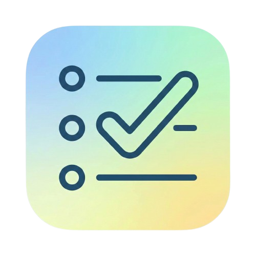

# LibreChat Task Manager

This is a customized fork of [LibreChat](https://github.com/danny-avila/LibreChat) designed to function as an automated task manager. It modifies the core client to inject real-time context of your personal life into every conversation and grants the AI the ability to manage TickTick tasks directly.

## Features

-   **Context Injection**: Every prompt sent to the AI is injected with:
    
    -   **Google Calendar**: Upcoming events for the next 7 days.
        
    -   **Gmail**: Summaries of emails from the past 30 days (summarized via Gemini).
        
    -   **TickTick**: Your current active task list.
        
    -   **Personal Context**: Custom bio/preferences defined in your environment variables.
        
-   **Automated Task Management**: The app creates the new tasks.
    

## Prerequisites

-   **Node.js** (v18+)
    
-   **MongoDB** (Setup a free DB here: https://www.mongodb.com/cloud/atlas/register)
    
-   **TickTick Account** (Setup a free account here: https://ticktick.com/signup)
    
-   **Google Cloud Project** with Gmail and Calendar APIs enabled.
    
-   **Google Gemini API Key** (AI Studio).

Google cloud console lets you start with $300 of free credits, which is more than enough for this project.

----------

## 1. Setup & Installation

### Clone the Repository

Bash

```
git clone https://github.com/AnthonyAndroulakis/LibreChat_Task_Manager.git
cd LibreChat_Task_Manager
```

### Install Dependencies

This fork adds several new dependencies (`googleapis`, `jsdom`, `luxon`) that must be installed in the root and/or api directory.

Bash

```
npm ci
cd api && npm install
```

### Google API Setup

You need to generate OAuth credentials to allow the app to read your Calendar and Gmail.

1.  Go to [Google Cloud Console](https://console.cloud.google.com/).
    
2.  Enable **Gmail API** and **Google Calendar API**.
    
3.  Create **OAuth 2.0 Client IDs** (Desktop or Web). Download the JSON file.
    
4.  **Token Generation**: You will need to perform a one-time OAuth flow to get your `access_token` and `refresh_token`. Save the resulting JSON.
    

### TickTick Setup

This integration uses TickTick's private API. You need to extract your cookie and device ID.

1.  Log into [TickTick Web](https://ticktick.com) in your browser.
    
2.  Open Developer Tools (F12) -> **Network** tab.
    
3.  Refresh the page and find a request to `ticktick.com`.
    
4.  Look at the **Request Headers**:
    
    -   Find the `Cookie` header and copy the value for `t` (e.g., `t=your_long_token_string`).
        
    -   Find the `X-Device` header (`TICKTICK_DEVICE_ID`)
        

----------

## 2. Configuration (.env)

Create or modify the `.env` file in the root directory. **Ensure all the following variables are set.**

### Core Security & Branding

Bash

```
# Point to mongo db database
MONGO_URI=

# Branding
APP_TITLE=TaskManagerAI

# Disable Search
SEARCH=false

# STRICT SECURITY: Do not allow others to register accounts
ALLOW_REGISTRATION=false
ALLOW_SOCIAL_REGISTRATION=false
```

### Google Integration

**Note:** The JSON variables must be minified (single line, no newlines) strings.

Bash

```
# Your Gemini API Key for summarization and chat
GOOGLE_KEY=AIzaSy...

# Google Client Credentials (content of client_secret.json)
GOOGLE_CLIENT_JSON={"installed":{"client_id":"...","project_id":"...","auth_uri":"...","token_uri":"...","client_secret":"..."}}

# Google User Token (content of the generated token.json with refresh_token)
GOOGLE_EMAIL_TOKEN_JSON={"access_token":"...","refresh_token":"...","scope":"...","token_type":"Bearer","expiry_date":1700000000000}
```

### TickTick Integration

Bash

```
# The 't' cookie value found in browser network tools
TICKTICK_TOKEN=your_ticktick_cookie_value

# The device ID found in browser network tools
TICKTICK_DEVICE_ID=your_device_id_value
```

### AI Personalization

Bash

```
# Preferred Models
GOOGLE_MODELS=gemini-2.5-pro
GOOGLE_TITLE_MODEL=gemini-2.0-flash-lite

# Personal Context Injection
# This text is added to the system prompt. Include your goals, bio, etc
PERSONAL_INFO=""
```

----------

## 3. How to Use

### Start the Application

Bash

```
npm run frontend:dev
npm run backend:dev
```

Access the site at `http://localhost:3080`.

### Interaction Flow

1.  **Chat**: When you send a message (e.g., "Plan my day"), the backend performs the following _before_ the AI sees your message:
    
    -   Fetches your Gmail emails for the past 30 days and summarizes them.
        
    -   Fetches your Google Calendar events for the next 7 days.
        
    -   Fetches all your current TickTick tasks.
        
2.  **AI Processing**: The AI receives your prompt + the retrieved context + your `PERSONAL_INFO`.
3. **Task Creation**: The app creates and imports TickTick tasks for the next 7 days.
